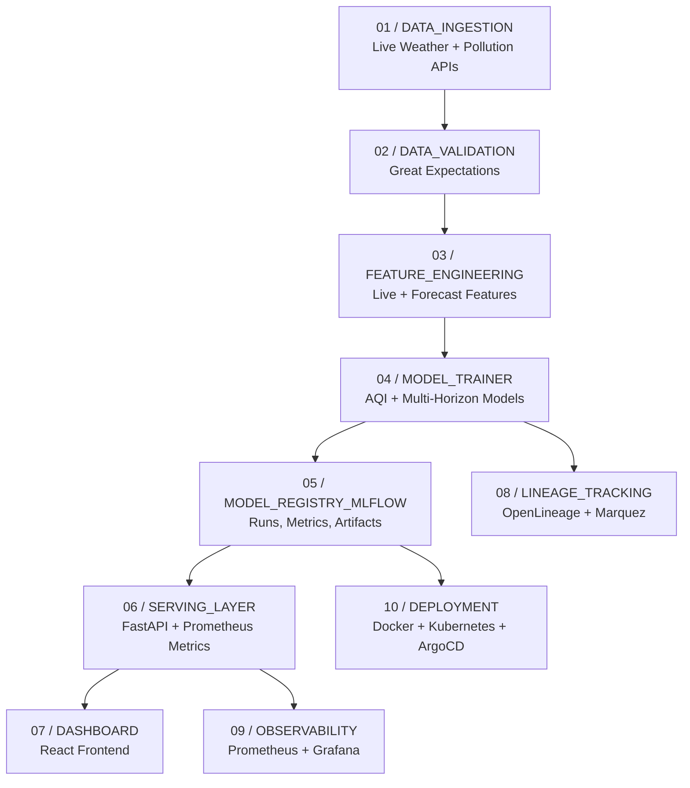

# Breathe Safe AI

<div align="center">

**Real-time Air Intelligence + Multi-Horizon AQI Forecasting + Production MLOps**

</div>

---

## System Pipeline



The end-to-end platform runs through these modular components:

1. Data Ingestion (`src/data/ingestion.py`): Pulls live environmental signals and prepares raw input frames.
2. Data Validation (`src/data/validation.py`): Executes schema and quality checks with Great Expectations.
3. Feature Engineering (`src/features/live_preprocessing.py`): Builds cleaned, model-ready live feature vectors.
4. Model Training (`src/models/train.py`, `src/models/train_forecast_multi_horizon.py`): Trains baseline AQI and 1/3/6/12/24h forecast models.
5. Model Registry (`mlflow`): Tracks experiments, metrics, and model artifacts.
6. Serving Layer (`src/api/main.py`): Exposes prediction and forecast APIs with telemetry.
7. Dashboard (`frontend/src/`): Provides the interactive web UI.
8. Lineage Tracking (`src/mlops/openlineage.py`): Emits OpenLineage events to Marquez.
9. Observability (`infrastructure/prometheus/`, `infrastructure/grafana/`): Collects system and API metrics.
10. Deployment (`infrastructure/kubernetes/`, `infrastructure/argocd/`): Supports GitOps-based rollout.

---

## Quick Start Guide

### 1. Run Backend API

```bash
python -m venv venv
venv\Scripts\activate
pip install -r requirements.txt
uvicorn src.api.main:app --host 127.0.0.1 --port 8000 --reload
```

- API Docs: [http://127.0.0.1:8000/docs](http://127.0.0.1:8000/docs)
- API Metrics: [http://127.0.0.1:8000/metrics](http://127.0.0.1:8000/metrics)

### 2. Run Frontend Dashboard

```bash
cd frontend
npm install
npm run dev
```

Open: [http://127.0.0.1:5173](http://127.0.0.1:5173)

### 3. Train Multi-Horizon Forecast Models

```bash
python -m src.data.build_city_hourly_dataset
python -m src.models.train_forecast_multi_horizon
```

Outputs:

- `data/processed/city_hourly_aqi.csv`
- `models/forecast_models/*.joblib`
- `models/forecast_models/training_summary.json`

---

## Core API Endpoints

- `GET /` -> Service health status
- `POST /predict` -> AQI prediction from model input features
- `GET /live-environment?lat=&lon=` -> Live weather + pollution payload
- `GET /predict-live?lat=&lon=` -> Live processed features for inference
- `GET /forecast?city=Hyderabad&hours=6` -> Horizon-aware AQI forecast
- `GET /metrics` -> Prometheus-formatted telemetry

---

## Forecasting Strategy

The forecast engine uses a hybrid horizon-aware approach:

- Current pollutant anchors (`pm2_5`, `pm10`, `no2`, `co`, AQI baseline)
- Horizon-specific weather projection (temperature, humidity, wind, condition)
- Trained model artifacts for `1h, 3h, 6h, 12h, 24h` when available
- Heuristic fallback path when trained artifacts are missing

Forecast model artifacts:

- `models/forecast_models/aqi_forecast_1h.joblib`
- `models/forecast_models/aqi_forecast_3h.joblib`
- `models/forecast_models/aqi_forecast_6h.joblib`
- `models/forecast_models/aqi_forecast_12h.joblib`
- `models/forecast_models/aqi_forecast_24h.joblib`

---

## MLOps Stack Coverage

- Source Control + CI/CD: `.github/workflows/`
- Model Serving API: `src/api/main.py`
- Interactive Frontend: `frontend/src/`
- Experiment Tracking + Registry: MLflow
- Containerization: `Dockerfile`, `docker-compose.yml`
- Data Quality: `gx/`, `src/data/validation.py`
- Feature Management: `feature_store/`
- Data Versioning: `.dvc/`
- Data Lineage: OpenLineage + Marquez
- Monitoring + Dashboards: Prometheus + Grafana
- Deployment Orchestration: Kubernetes + ArgoCD
- Prompt Evaluation Layer: `promptfoo/`

---

## Docker Profiles

Run core services:

```bash
docker compose up -d --build api frontend mlflow
```

Run observability stack:

```bash
docker compose --profile observability up -d
```

Run lineage stack:

```bash
docker compose --profile lineage up -d
```

---

## Environment Variables

Create `.env` from `.env.example`:

```bash
OPENWEATHER_API_KEY=your_openweather_key
GROQ_API_KEY=your_groq_key
GROQ_MODEL=llama3-8b-8192
OPENLINEAGE_URL=http://127.0.0.1:5001/api/v1/lineage
OPENLINEAGE_NAMESPACE=breathe-safe-ai
```
